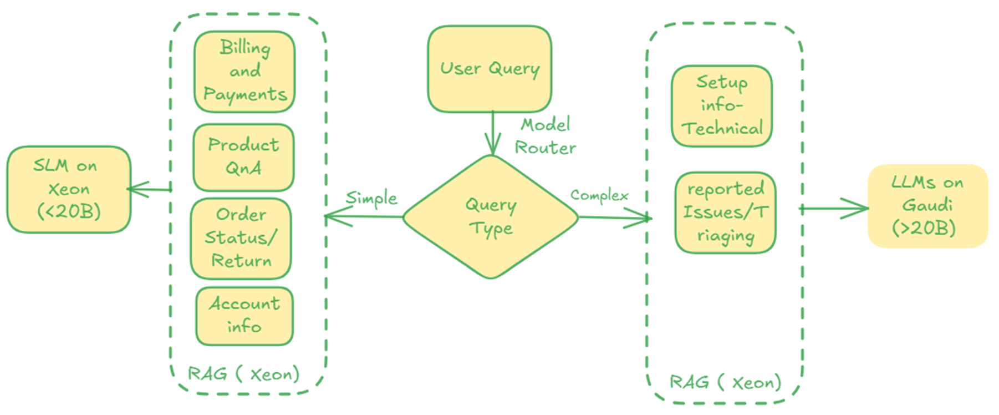

# Multi-Skill Customer Support Assistant

A multi-skill customer support assistant for product questions, billing, shipping, and technical support with dynamic routing to databases and hardware.

## Table of contents

- [Detailed description](#detailed-description)
  - [See it in action](#see-it-in-action)
  - [Architecture diagrams](#architecture-diagrams)
- [Requirements](#requirements)
  - [Minimum hardware requirements](#minimum-hardware-requirements)
  - [Minimum software requirements](#minimum-software-requirements)
  - [Required user permissions](#required-user-permissions)
- [Deploy](#deploy)
  - [Delete](#delete)
- [References](#references)
- [Technical details](#technical-details)
- [Tags](#tags)

## Detailed description

Customer support teams face huge loads in product FAQs, billing, returns and technical questions. Chatbots built with a single generic LLM fail because answers require domain knowledge. Hosting 5 specialized LLMs is expensive, operationally heavy, and not scalable. In addition, how can the appropriate hardware be selected to handle simple versus complex queries?

The solution - using dynamic database and model routers. The first semantic router will determine whether the query is simple or complex. A second semantic router will determine the type of query, ranging from the following:

- **Product Q&A** (simple)
- **Billing and Payments** (simple)
- **Shipping and Returns** (simple)
- **Account Info** (simple)
- **Technical Setup** (complex)
- **Reported Issues/Triaging** (complex)

Based on this type of query, the corresponding vector database with specialized knowledge of that specific area will be used for retrieval augmented generation (RAG). This provides context to the original query by modifying the query before inputting into the LLM.

A small base model is deployed on a CPU and a large base model is deployed on a GPU or AI accelerator. vLLM is used as the inference serving engine for optimal performance. Based on the complexity of the query, the modifyed query will be passed to the appropriate hardware.

The goals achieved include:
- **Avoids training** a huge "omni-support" LLM and any specialized finetuning
- **Higher accuracy** of queries
- **Optimal cost efficiency** to process queries with the appropriate hardware type 

### Architecture diagrams



## Requirements

### Minimum hardware requirements 

- 8+ vCPUs, preferably from 4th Gen Intel® Xeon® Scalable Processors or newer
- 24+ GiB RAM
- 1 Intel® Gaudi® AI Accelerator with 8 cards

### Minimum software requirements

- Red Hat OpenShift
- Red Hat OpenShift AI 2.16+
- OpenShift CLI (`oc`) - [Download here](https://docs.openshift.com/container-platform/latest/cli_reference/openshift_cli/getting-started-cli.html)
- Helm CLI (`helm`) - [Download here](https://helm.sh/docs/intro/install/)

### Required user permissions

- Standard user. No elevated cluster permissions required

## Deploy

### Clone the repository

```bash
git clone https://github.com/rh-ai-quickstart/multi-skills-llm
cd multi-skills-llm
```

### Create the project

```bash
oc new-project multiskill-assistant-demo
```

### Build and deploy the helm chart

TODO: add steps with *helm dependency build* and *helm install*

TODO: explain the components installed 

## Test

TODO: explain how to access the UI, give sample simple and complex queries of different types, show which hardware is selected, and include screenshots of sample outputs

### Delete

To uninstall and delete the project:

```bash
helm uninstall multiskill-assistant
oc delete project multiskill-assistant-demo
```

## References 

TODO: optional
